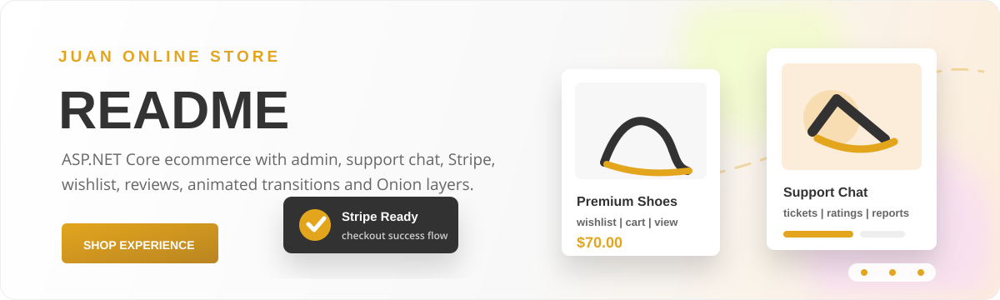

<p align="center">
  
</p>

<p align="center">
  <a href="#quick-start"></a>
  <a href="#architecture"></a>
  <a href="#features"></a>
  <a href="#database"></a>
</p>

<h1 align="center">🛍️ Juan NET</h1>

<p align="center">
  A polished ASP.NET Core ecommerce project with a storefront, admin dashboard, Stripe checkout, support tickets, profile tools, reviews, wishlists, basket flows, image uploads, background services, and animated page transitions.
</p>

---

## 📚 Table Of Contents

1. [About](#about)
2. [Visual Identity](#visual-identity)
3. [Features](#features)
4. [Architecture](#architecture)
5. [Project Structure](#project-structure)
6. [Quick Start](#quick-start)
7. [Configuration](#configuration)
8. [Database](#database)
9. [Main Flows](#main-flows)
10. [Admin Area](#admin-area)
11. [Support Center](#support-center)
12. [Payments](#payments)
13. [Uploads](#uploads)
14. [Frontend Notes](#frontend-notes)
15. [Testing Checklist](#testing-checklist)
16. [Troubleshooting](#troubleshooting)
17. [Roadmap](#roadmap)
18. [Credits](#credits)

---

## ✨ About

Juan NET is an online store built with Onion Architecture in a .NET solution.

The customer-facing side behaves like a classic fashion or product shop.

The project includes a real catalog experience.

Products can be shown on the home page.

Products can be browsed through the products page.

Categories are represented as first-class entities.

Product cards include price, image, category metadata, stock state, and quick actions.

The UI includes wishlist actions.

The UI includes basket actions.

The UI includes quick view product modals.

The store header is shared across the storefront.

The profile area has its own user-focused views.

The admin area has its own dashboard layout.

The support area has its own support layout.

The backend uses ASP.NET Core MVC.

The persistence layer uses Entity Framework Core.

The database target is SQL Server.

The payment flow is prepared for Stripe.

The image pipeline uses ImageSharp.

The application has background services.

The solution is separated into Domain, Application, Persistence, Infrastructure, and Web projects.

The visual style follows the original Juan shop template: clean white surfaces, warm gold accents, product imagery, lightweight borders, and smooth hover transitions.

---

## 🎨 Visual Identity

The main accent color is `#e3a51e`.

The main text color is `#333333`.

The secondary text color is `#666666`.

The light page background is `#ffffff`.

The soft gray panel color is `#f8f8f8`.

The service policy backgrounds include `#fcedda`, `#f2fbcb`, and `#f7d8f9`.

The typography uses Montserrat for headings.

The typography uses Open Sans for body copy.

The storefront favors clean spacing.

The storefront favors product photos over heavy decorative UI.

The UI includes slick carousel behavior.

The UI includes animated page transitions.

The UI includes a loader with three animated gold dots.

The README banner mirrors that same mood.

The README banner uses the store's gold highlight.

The README banner includes animated product cards.

The README banner includes a checkout signal.

The README banner includes support center messaging.

The README intentionally reads like the project, not like a generic template.

---

## 🚀 Features

### Storefront

- Home page with dynamic sliders.
- Product carousel on the landing view.
- Product cards with images.
- Product cards with prices.
- Product cards with category labels.
- Product cards with stock state.
- Product quick view modal.
- Quantity validation inside quick view.
- Basket action from product cards.
- Wishlist action from product cards.
- Category browsing.
- Product listing page.
- Contact page.
- Shared store header.
- Shared store footer.
- Responsive Bootstrap-based layout.
- Font Awesome action icons.
- Slick slider interactions.
- View transition animations.
- Loader animation.

### Account

- Login view.
- Register view.
- Forgot password view.
- Reset password view.
- Two-factor view model.
- Profile view.
- Profile image support.
- Address management.
- Delivery information.
- Order history.
- Password change flow.
- Security token storage.
- Cookie authentication.
- Login redirects for protected routes.

### Shopping

- Basket item entity.
- Wishlist item entity.
- Checkout view model.
- Local shop item input.
- Order entity.
- Order item entity.
- Order totals.
- Delivery totals.
- Discount totals.
- Stripe session storage.
- Stripe payment intent storage.
- Payment success page.
- Payment cancel page.

### Admin

- Admin dashboard.
- Product management.
- Category management.
- Slider management.
- Footer settings management.
- Contact message management.
- Subscriber management.
- User management.
- Role management.
- Role permission catalog.
- Refund management.
- Admin permission attribute.
- Admin access service.
- Role color support.
- Display order support.

### Support

- Support ticket entity.
- Support message entity.
- Support rating entity.
- Support ticket created-date entity.
- Operator work-time entity.
- User support chat.
- Support chat history.
- Support order selection.
- Operator support dashboard.
- Ticket details page.
- Ticket reports page.
- Active report page.
- Support attachments upload folder.
- Support rating input.
- Support dashboard view model.
- Support report cleanup service.
- Support work-time tracking.

### Reviews And Engagement

- Product review entity.
- Product review input.
- Product review summary view model.
- Unique user/product review constraint.
- Favorite category entity.
- Favorite category digest entity.
- Favorite category digest background service.
- Subscriber entity.
- Contact message entity.

---

## 🧱 Architecture

The solution follows an Onion Architecture layout.

The Web project owns MVC controllers, Razor views, static assets, and route setup.

The Domain project owns entities.

The Application project owns application-level authorization constants and DTO-like support classes.

The Persistence project owns EF Core and SQL Server registration.

The Infrastructure project owns services that connect the app to files, email, support workflows, database infrastructure, and background jobs.

The startup path is `Juan-NET.Web/Program.cs`.

The default route is `{controller=Home}/{action=Index}/{id?}`.

The app listens on `http://localhost:5219`.

OpenAPI is mapped in development.

Static files are enabled.

Request localization is set to `en-US`.

Cookie authentication is configured.

The login path is `/Account/Login`.

The access denied path is `/Account/Login`.

The custom Razor view locations are `/View/{1}/{0}.cshtml` and `/View/Shared/{0}.cshtml`.

The database infrastructure initializer runs during app startup.

The initializer prepares admin access infrastructure.

The initializer prepares favorite category infrastructure.

The initializer prepares shop list infrastructure.

The initializer prepares site settings infrastructure.

The initializer prepares order infrastructure.

The initializer prepares support infrastructure.

The initializer prepares product review infrastructure.

---

## 🗂️ Project Structure

```text
Juan-NET/
├── Juan-NET.Application/
│   └── Authorization/
├── Juan-NET.Domain/
│   └── Entities/
├── Juan-NET.Infrastructure/
│   ├── BackgroundServices/
│   ├── Database/
│   ├── Payments/
│   └── Services/
├── Juan-NET.Persistence/
│   ├── Context/
│   └── Migrations/
├── Juan-NET.Web/
│   ├── Controllers/
│   ├── Services/
│   ├── View/
│   ├── ViewModels/
│   └── wwwroot/
└── Juan-NET.slnx
```

### Web Layer

- `Controllers` handle HTTP requests.
- `View` contains Razor views.
- `View/Shared` contains shared layouts and partials.
- `ViewModels` shape data for pages.
- `wwwroot/main assets` contains customer-facing CSS, JS, images, and fonts.
- `wwwroot/admin assets` contains admin CSS, JS, and images.
- `wwwroot/uploads` contains uploaded product, slider, profile, and support files.

### Domain Layer

- `Product` models a store item.
- `Category` models product grouping.
- `ProductCategory` models the many-to-many relationship.
- `User` models a customer or admin user.
- `Order` models a checkout order.
- `OrderItem` models a purchased line item.
- `SupportTicket` models a support conversation.
- `SupportMessage` models a support chat message.
- `SupportRating` models user feedback for support.
- `ProductReview` models product feedback.
- `Subscriber` models newsletter subscription.
- `SiteFooterSettings` models footer content.

### Persistence Layer

- `AppDbContext` exposes the EF Core sets.
- Entity indexes live in `OnModelCreating`.
- Decimal money fields use `decimal(18,2)`.
- Rating fields use `decimal(2,1)`.
- SQL defaults are used for creation dates.
- Unique constraints are used for emails, category names, ticket codes, review pairs, and Stripe session ids.
- Cascade behavior is explicit where relationships need it.

### Infrastructure Layer

- `ImageStorageService` handles image storage.
- `EmailService` handles email concerns.
- `AdminAccessService` evaluates admin permissions.
- `SupportWorkTimeService` updates support operator work time.
- `SupportReportCleanupService` runs as a hosted service.
- `FavoriteCategoryDigestService` runs as a hosted service.
- `StripeSettings` holds payment-related settings.

---

## ⚡ Quick Start

### Requirements

- .NET SDK compatible with `net10.0`.
- SQL Server or SQL Server LocalDB.
- A connection string named `Default`.
- Optional Stripe keys if you want to test checkout against Stripe.
- Optional SMTP or email settings if email flows are enabled in your environment.

### Run Locally

1. Clone the repository.
2. Open the solution folder.
3. Configure the `Default` connection string.
4. Apply migrations if your database is empty.
5. Start the web project.
6. Open `http://localhost:5219`.

### Useful Commands

```powershell
dotnet restore
```

```powershell
dotnet build
```

```powershell
dotnet run --project .\Juan-NET.Web\Juan-NET.Web.csproj
```

```powershell
dotnet ef database update --project .\Juan-NET.Persistence\Juan-NET.Persistence.csproj --startup-project .\Juan-NET.Web\Juan-NET.Web.csproj
```

### Development URL

```text
http://localhost:5219
```

---

## 🔧 Configuration

The app reads configuration through ASP.NET Core configuration providers.

The persistence layer expects a connection string named `Default`.

Development logging is configured in `Juan-NET.Web/appsettings.Development.json`.

The project currently keeps development logging simple.

Secrets should be stored with user secrets or environment variables.

Do not commit real Stripe secret keys.

Do not commit real SMTP passwords.

Do not commit production database credentials.

### Example Connection String

```json
{
  "ConnectionStrings": {
    "Default": "Server=(localdb)\\MSSQLLocalDB;Database=JuanNet;Trusted_Connection=True;TrustServerCertificate=True"
  }
}
```

### Example Stripe Settings

```json
{
  "Stripe": {
    "SecretKey": "sk_test_replace_me",
    "PublishableKey": "pk_test_replace_me",
    "WebhookSecret": "whsec_replace_me"
  }
}
```

### Example Email Settings

```json
{
  "Email": {
    "From": "store@example.com",
    "Host": "smtp.example.com",
    "Port": 587,
    "UserName": "store@example.com",
    "Password": "replace_me"
  }
}
```

---

## 🗄️ Database

The database is managed by Entity Framework Core.

The provider is SQL Server.

The main context is `AppDbContext`.

The context is registered by `AddPersistence`.

The context reads `ConnectionStrings:Default`.

The migrations folder is in `Juan-NET.Persistence/Migrations`.

The app has a migration named `20260512130000_SplitUserAddressAndSecurityToken`.

The context includes products.

The context includes categories.

The context includes product categories.

The context includes sliders.

The context includes users.

The context includes user addresses.

The context includes user security tokens.

The context includes subscribers.

The context includes contact messages.

The context includes admin roles.

The context includes admin role permissions.

The context includes user admin roles.

The context includes user favorite categories.

The context includes favorite category digests.

The context includes basket items.

The context includes wishlist items.

The context includes footer settings.

The context includes orders.

The context includes order items.

The context includes support tickets.

The context includes support ticket created dates.

The context includes support messages.

The context includes support ratings.

The context includes product reviews.

The context includes support operator work times.

---

## 🧭 Main Flows

### Home Flow

1. `HomeController` builds the home page model.
2. `Home/Index.cshtml` renders sliders.
3. The store header partial is rendered.
4. The hero carousel uses slider data.
5. Service policy cards communicate shipping, support, and returns.
6. Product cards render the current product set.
7. Product metadata is embedded in `data-*` attributes.
8. Quick view reads the selected product metadata.
9. The modal updates the product image, title, price, description, categories, and stock.
10. Quantity input is normalized before basket submission.

### Product Flow

1. Products are stored in the database.
2. Product images can come from uploads.
3. Products can belong to multiple categories.
4. Product listing view models shape the catalog page.
5. Product review summaries can be shown with product details.
6. Out-of-stock cards are visually disabled.

### Account Flow

1. Users authenticate with cookies.
2. Protected paths redirect to the login page.
3. Profile data is rendered through profile view models.
4. Addresses are separated from security tokens.
5. Orders are shown through profile order view models.
6. Security flows use reset and two-factor view models.

### Checkout Flow

1. Basket items are collected for the authenticated user.
2. Checkout creates an order model.
3. Stripe session data can be stored on the order.
4. Successful payment lands on the success view.
5. Cancelled payment lands on the cancel view.
6. Order history remains available in the account area.

---

## 🛠️ Admin Area

The admin area is designed as an operational surface.

It has a dedicated shared layout.

It includes admin-specific assets.

It uses permission checks instead of a single hard-coded admin flag.

Permissions are centralized in `AdminPermissionKeys`.

Permission display data is centralized in the admin permission catalog.

Roles can have colors.

Roles can have display order.

Users can be assigned admin roles.

Roles can map to permission keys.

Admin permissions cover areas such as products, categories, sliders, footer settings, subscribers, contact messages, users, roles, refunds, and support.

This makes the dashboard easier to grow without turning every admin check into custom controller code.

---

## 💬 Support Center

The support center is one of the more complete parts of the project.

Customers can start support conversations.

Customers can view support chat history.

Customers can relate support messages to orders.

Operators can work from support views.

Tickets have statuses.

Tickets have priorities.

Tickets have topics.

Tickets have unique codes.

Tickets can be assigned to operator users.

Messages belong to tickets.

Ratings belong to tickets.

Ratings also connect to users and operators.

Operator work time is tracked per day.

The app updates work time when an authenticated support operator visits support paths.

Reports are supported through dedicated view models.

Cleanup runs through a hosted service.

The support upload folder stores support attachments.

---

## 💳 Payments

Stripe is included through `Stripe.net`.

The web project references `Stripe.net` version `51.0.1`.

Payment configuration should live outside committed source.

Orders can store a Stripe session id.

Orders can store a Stripe payment intent id.

The Stripe session id has a unique filtered index.

Payment success and cancel pages are already represented by Razor views.

For local testing, use Stripe test keys.

For production, use environment variables or a secure secret store.

For webhooks, validate the Stripe signature before trusting the event.

For refunds, use the admin refund flow as the operational entry point.

---

## 🖼️ Uploads

Uploaded product images live under `Juan-NET.Web/wwwroot/uploads/products`.

Uploaded slider images live under `Juan-NET.Web/wwwroot/uploads/sliders`.

Uploaded profile images live under `Juan-NET.Web/wwwroot/uploads/profiles`.

Uploaded support files live under `Juan-NET.Web/wwwroot/uploads/support`.

ImageSharp is available in the infrastructure layer.

The default product image points to `/main assets/img/product/product-1.jpg`.

The storefront gracefully falls back when product images are missing.

Keep uploaded files web-safe.

Prefer compressed `.webp` images for store media.

Use descriptive alt text in views when adding new image surfaces.

---

## 🎞️ Frontend Notes

The main stylesheet is `Juan-NET.Web/wwwroot/main assets/css/style.css`.

The account stylesheet is `Juan-NET.Web/wwwroot/main assets/css/account.css`.

The admin stylesheet is `Juan-NET.Web/wwwroot/admin assets/css/admin.css`.

The main JavaScript files live in `Juan-NET.Web/wwwroot/main assets/js`.

The admin JavaScript files live in `Juan-NET.Web/wwwroot/admin assets/js`.

The page transition system uses the View Transitions API when available.

The fallback page shell animation uses opacity, transform, and blur.

The loader uses three gold dots.

Motion is reduced when `prefers-reduced-motion: reduce` is active.

The product modal uses a sticky product image area on larger screens.

The modal becomes stacked on smaller screens.

Store cards use restrained borders and shadow.

Admin screens should stay dense and readable.

Support screens should stay fast to scan.

Buttons should keep the warm gold accent.

Forms should use clear labels and focused border states.

---

## ✅ Testing Checklist

- Build the solution with `dotnet build`.
- Run the web app.
- Open the home page.
- Confirm sliders render.
- Confirm product images render.
- Confirm quick view opens.
- Confirm quick view quantity cannot exceed stock.
- Confirm basket action works.
- Confirm wishlist action works.
- Confirm product listing opens.
- Confirm category page opens.
- Confirm contact page opens.
- Register a test user.
- Login as the test user.
- Update profile data.
- Upload a profile image.
- Add an address.
- Open checkout.
- Complete a Stripe test checkout.
- Verify success page.
- Verify cancel page.
- Open order history.
- Create a support ticket.
- Send a support message.
- Open support history.
- Login as an admin or support operator.
- Open the admin dashboard.
- Edit a product.
- Edit a category.
- Edit a slider.
- Edit footer settings.
- Review contact messages.
- Review subscribers.
- Review users.
- Review roles.
- Review refunds.
- Open support reports.
- Rate a support ticket.
- Restart the app and confirm infrastructure initialization remains idempotent.

---

## 🩺 Troubleshooting

### The App Cannot Connect To SQL Server

Check the `Default` connection string.

Confirm SQL Server or LocalDB is running.

Confirm the database exists or migrations have been applied.

Confirm the user has permission to create or update the database.

### Migrations Do Not Run

Install the EF Core CLI if needed.

Run the migration command from the solution root.

Use the Persistence project as the migrations project.

Use the Web project as the startup project.

### Static Files Are Missing

Confirm `app.UseStaticFiles()` is still in `Program.cs`.

Confirm asset paths include the `main assets` or `admin assets` folder names.

Remember that the folder names contain spaces.

### Images Do Not Render

Check that the stored URL starts with `/uploads/...` or a valid static path.

Check that the file exists under `wwwroot`.

Check browser dev tools for 404 responses.

Use `.webp`, `.jpg`, or `.png` files that browsers can display.

### Login Redirects Unexpectedly

Check the cookie authentication setup.

Check that the user is authenticated.

Check that permission-protected paths map to the right admin role permission.

### Stripe Checkout Fails

Check test keys.

Check API key configuration.

Check the Stripe dashboard test logs.

Check order creation before session creation.

Check success and cancel URLs.

### Support Work Time Does Not Update

Confirm the user is authenticated.

Confirm the user has the support permission.

Confirm the request path starts with `/Support`.

Confirm `SupportWorkTimeService` is registered.

---

## 🧭 Roadmap

- Add integration tests for checkout.
- Add integration tests for support tickets.
- Add admin UI tests for permissions.
- Add seed data for demo products.
- Add seed data for demo sliders.
- Add stricter image validation.
- Add webhook handling documentation.
- Add screenshots of storefront pages.
- Add screenshots of admin pages.
- Add screenshots of support pages.
- Add deployment notes.
- Add production security checklist.
- Add localization notes.
- Add analytics events for product actions.
- Add more product filtering options.
- Add product comparison flow.
- Add coupon management.
- Add stock movement history.
- Add order status timeline.
- Add email templates.
- Add support SLA indicators.
- Add support export reports.
- Add favorite category digest preview.
- Add README screenshots once stable screenshots are captured.

---

## 🙌 Credits

Juan NET is built around ASP.NET Core MVC, Entity Framework Core, SQL Server, Stripe, ImageSharp, Bootstrap-style layouts, Slick carousel behavior, Font Awesome icons, Montserrat headings, Open Sans body copy, and a warm ecommerce visual system.

The project is intentionally practical.

It is not just a static storefront.

It includes user flows.

It includes admin flows.

It includes support flows.

It includes payment flows.

It includes background work.

It includes upload handling.

It includes a clear Onion Architecture structure.

It is ready to keep growing.

---

<p align="center">
  <strong>Juan NET</strong><br />
  Clean storefront. Useful admin. Real support workflow. Warm gold finish.
</p>
